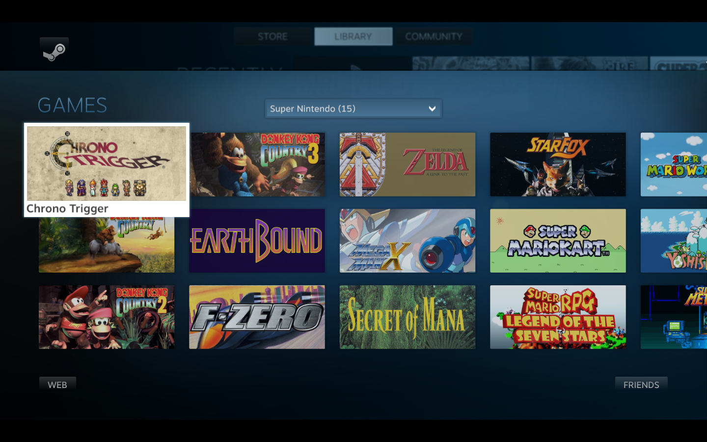

##Ice

###Description

The purpose of this project is to leverage Steam's Big Picture mode to turn it
into an emulator frontend (similar to Hyperspin). It accomplishes this by
creating folders in specified locations on the users hard drive, and when a ROM
is placed in one of those folders, my application will automatically add it to
Steam as a non-steam game. Emulators to run each game should come 
pre-configured to support Xbox 360 controllers intelligently while still 
allowing all Steam features to be accessible (community etc)

###License

All of my code is licensed under MIT.

###Setup

All that is needed to set up Ice is to correctly set Steam's installation location in config.txt.

###Usage Instructions

Running Ice for the first time is slightly different than running it afterwards. The first time you run Ice, it will do two very important things

1. Download emulators for any supported systems
2. Create the ROMs folder where you should place your ROM files

After Ice has run the first time, you should put all of your files inside the ROMs folder in the correct location. Once that is done, run Ice again, and you're done! All of your ROMs should act as playable games in Steam.

###Running the Source

To run the source, besides the setup instructions, you will also need to have Python installed. Python 2.7 is required.

If you have Python installed, simply run

    python ice.py
    
from the repository's root directory. On Mac/Linux, you should also be able to use the command

    ./ice.py
    
provided the file has the execute permission.

###Goal Updates

Originally, I wanted to make an application that would constantly 'watch' the ROMs folder and modify the shortcuts.vdf file as changes were made to the folder. I have since found out that Steam doesn't take kindly to having it's shortcuts.vdf file updated while it is running, and will overwrite any changes that are made to the file on close.

With this in mind, you now need to run Ice every time a change is made for it to update your shortcuts.vdf. This is not an ideal solution, and in the future I will see what I can do to make this experience better.

##Steam Grid Images

###Sources

The user can specify which website they want to use to source their Steam Grid
Images. I put this is in so people have options, but my code isn't completely
flexible. If someone wants to make their site a valid Grid Image Source, the
request path needs to...

- Accept 2 arguments:
  - Name - The name of the ROM
  - Console - The shortname of the console this ROM is on. See below
- Respond with a 204 No Content if the game was not found
- Respond with the empty string if there is no picture for the game
- Respond with a URL, which is the URL of the picture to download (needs to be
  a full URL, not a path).
  
##Emulators

###License Issues

Most of the emulators use permissive licenses. The most common are MIT and GPL.
A few include clauses that they are only to be used for personal use, so if you
want to use my code for commercial use you need to get different emulators.

###BIOS Issues

Ice includes PS1 and PS2 emulators. These emulators are slightly different from all of the others in that they requires a legal PS1/PS2 BIOS to run. The only legal way to obtain these BIOS files is to dump the BIOS of your physical Playstation. If you are curious, there are plenty of guides online describing how to do it.

The BIOS files for PS1/PS2 should be named PS1.bin and PS2.bin respectively. These files should be placed in the same location as the ROMs for that system, and will be automatically used by Ice next time it is run.

Please note that you need to run Ice after adding these files before the emulator will work.

###Console Shortnames

Shortnames are used in many places. They are used as the folder names where the
user puts ROMs, and are used in the URL of the Grid Image Source request. The
full list of shortnames is below

####Supported Consoles

* NES - Nintendo Entertainment System
* SNES - Super Nintendo
* N64 - Nintendo 64
* Gamecube - Nintendo Gamecube
* PS1 - Sony Playstation
* PS2 - Sony Playstation 2
* Genesis - Sega Genesis
* Gameboy - Nintendo Gameboy
* GBA - Nintendo Gameboy Advance

####Unsupported Consoles (which may be supported later)

* Wii - Nintendo Wii
* Dreamcast - Sega Dreamcast
* DS - Nintendo DS
